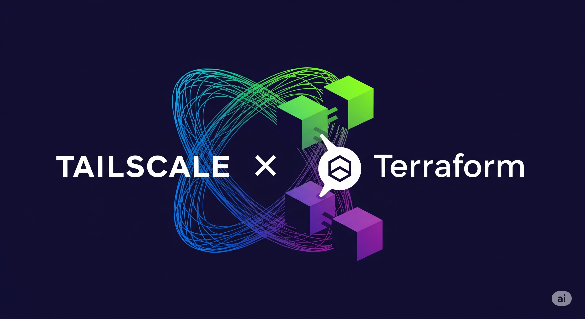

# Terraform AWS EC2 with Tailscale

This project utilizes Terraform to provision an AWS EC2 instance. The EC2 instance is configured with Tailscale via a user data script, allowing it to function as a node within your Tailscale network. The setup supports deployment to specific AWS regions, namely `ap-south-2` (Mumbai) and `me-central-1` (UAE), with pre-configured key pairs and security groups.

## Prerequisites

Before deploying this infrastructure, ensure you have the following:

*   **Terraform CLI**: Version `1.5.0` or higher.
*   **AWS CLI**: Installed and configured with a profile named `home`. This profile must have the necessary permissions to create EC2 instances, use AMIs, key pairs, and security groups in the target AWS regions.
*   **AWS EC2 Key Pair**: `add as per your needs & conveience`
    *   A key pair named `tf-key` existing in the `ap-south-2` region.
    *   A key pair named `gw-dxb` existing in the `me-central-1` region.
*   **AWS EC2 Security Group**: A security group named `launch-wizard-1` existing in your AWS account. This security group should be configured to allow inbound SSH (port 22) and any other necessary traffic for your Tailscale setup.
*   **Tailscale Authentication Key**: The `tailscale.sh.tpl` template uses a hardcoded Tailscale authentication key. For production environments, consider securing this key using Terraform variables, environment variables, or a secrets manager.
    *   To obtain a Tailscale authentication key:
        1.  Log in to your Tailscale account at [https://login.tailscale.com/admin/settings/authkeys](https://login.tailscale.com/admin/settings/authkeys).
        2.  Navigate to the "Auth keys" section.
        3.  Generate a new reusable authentication key.
        4.  Copy the generated key.

## Usage
```shell
$ alias tf=terraform

$ tf init
$ export TF_REGION=ap-south-2 # or me-central-1

$ tf <plan|apply|destroy> -var="active_region=$TF_REGION"
```
